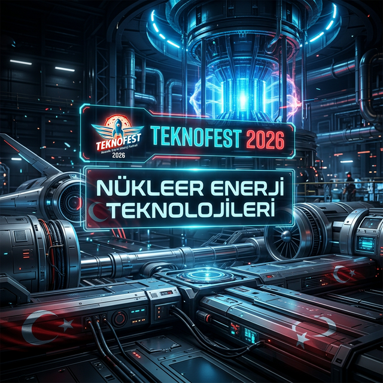



  

 

  
  
  

 

  <h1>☢️ TEKNOFEST NÜKLEER ENERJİ TEKNOLOJİLERİ TASARIM YARIŞMASI</h1>
  
<b>Milli Teknoloji Hamlesi Işığında, Geleceğin Enerji Mimarisi</b>

---

## � Yarışma Hakkında: Vizyon ve Stratejik Önem

TEKNOFEST Havacılık, Uzay ve Teknoloji Festivali kapsamında düzenlenen **Nükleer Enerji Teknolojileri Tasarım Yarışması**, Türkiye’nin enerji bağımsızlığı yolunda attığı en kritik adımlardan biridir. T.C. Enerji ve Tabii Kaynaklar Bakanlığı ile **TENMAK** (Türkiye Enerji, Nükleer ve Maden Araştırma Kurumu) ortaklığında yürütülen bu süreç, sadece bir yarışma değil, aynı zamanda yerli nükleer ekosistemin inşası için bir kuluçka merkezidir. 

Türkiye'nin 2053 net sıfır emisyon hedefleri doğrultusunda nükleer enerji, baz yük güç kaynağı olarak hayati önem taşımaktadır. Bu yarışma, genç mühendislerin bu stratejik alanda "öğrenen sistemler" geliştirmesini, nükleer emniyet kültürünü içselleştirmesini ve uluslararası standartlarda (IAEA, WENRA vb.) tasarım yetkinliği kazanmasını amaçlar. Projemiz, bu vizyonun bir parçası olarak, nükleer teknolojileri sadece teorik düzeyde değil, uygulanabilir mühendislik çözümleri olarak ele almaktadır.

---

## 🏗️ Yarışma Teması: Yeni Nesil Modüler Reaktörler

Geleneksel büyük ölçekli nükleer santrallerin yerini almaya başlayan **Modüler Reaktörler**, yarışmanın odak noktasını oluşturmaktadır. Bu tasarımlar, düşük başlangıç sermaye maliyeti, fabrikada seri üretim imkanı ve gelişmiş güvenlik özellikleri ile öne çıkmaktadır.

### 1. Küçük Modüler Reaktörler (SMR - Small Modular Reactors)
SMR'lar, tipik olarak 300 MWe'ye kadar güç kapasitesine sahip, modüler yapıda tasarlanan reaktörlerdir. Projemizde SMR tasarımları; pasif soğutma sistemleri, integral basınçlı su reaktörü (iPWR) mimarileri ve yüksek yanma oranlı yakıt döngüleri üzerinden analiz edilmektedir. SMR'ların şebeke esnekliği ve uzak bölgelere enerji sağlama kapasitesi, tasarım parametrelerimizin temelini oluşturur.

### 2. Mikro Modüler Reaktörler (MMR - Micro Modular Reactors)
Genellikle 1-10 MW güç aralığında olan MMR'lar, "tak-çıkar" (plug-and-play) enerji üniteleri olarak kurgulanmaktadır. Özellikle otonom çalışma kapasitesi ve nakledilebilirlik (transportability) özellikleri, bu kategorideki mühendislik zorluklarının merkezindedir. Hidrit yakıtlar veya erimiş tuz gibi yenilikçi soğutucu teknolojileri bu kapsamda değerlendirilmektedir.

### 3. Çok Amaçlı Yenilikçi Araştırma Reaktörleri
Radyoizotop üretimi, malzeme testleri ve temel fizik araştırmaları için tasarlanan bu reaktörlerde, yüksek nötron akısı yönetimi ve termal spektrum optimizasyonu en kritik mühendislik alanlarıdır.

---

## 📊 Detaylı Yarışma Kategorileri ve Teknik İçerik

Yarışma, nükleer mühendisliğin tüm katmanlarını kapsayan **10 spesifik disipline** bölünmüştür. Her bir kategori, karmaşık bir optimizasyon matrisini temsil eder:

### 🔬 Fizik ve Tasarım Optimizasyonu
*   **Detay Tasarım Kategorisi:** Başından sonuna kadar tüm sistem süreçlerini içeren, reaktör kalbinden enerji çevrimine kadar sistemin tamamının optimize edildiği "büyük resim" kategorisidir.
*   **Reaktör Kor Tasarımı:** Nötronik hesaplamalar, kritiklik analizleri (K-effective), güç yoğunluğu dağılımı ve nötron spektrum analizlerini içerir. Burada amaç, yakıt verimliliğini maksimize ederken reaktivite geri besleme katsayılarını güvenli aralıkta tutmaktır.
*   **Nükleer Yakıt ve Atık Yönetimi:** Yakıtın zenginleştirme derecesinden, kullanılmış yakıtın soğuma havuzlarındaki termal analizlerine ve uzun vadeli depolama stratejilerine kadar olan döngüyü kapsar.

### ⚙️ Mühendislik ve Güvenlik Sistemleri
*   **Pasif Güvenlik Sistemi Tasarımı:** Doğal sirkülasyon, yerçekimi bazlı enjeksiyon ve pasif koruma kabuğu soğutma sistemleri gibi, hiçbir elektrik gücü veya operatör müdahalesi gerektirmeyen "Failsafe" mekanizmaların tasarımıdır.
*   **Enerji Çevrimi Tasarımı:** Reaktörden elde edilen termal enerjinin Rankine veya Brayton döngüleri kullanılarak maksimum verimle elektriğe dönüştürülmesi; ısı değiştiricilerin (SG) ve türbin sistemlerinin optimizasyonudur.
*   **Nükleer Enstrümantasyon ve Kontrol (I&C):** Reaktörün "sinir sistemi". Nötron dedektörleri, sıcaklık sensörleri ve SCADA sistemleri ile reaktörün kontrol çubukları üzerinden stabil tutulması ve otonom durdurma (SCRAM) algoritmaları.

---

## 📅 Raporlama ve Değerlendirme Metrikleri

Başarıya giden yol, katı raporlama aşamalarından ve teknik doğrulama süreçlerinden geçer:

1.  **Ön Değerlendirme Raporu (ÖTR):** Tasarımın kavramsal temelleri, seçilen reaktör tipinin rasyoneli ve projenin yenilikçi (inovasyon) yönü sorgulanır. Ekip yapısı ve iş planı bu aşamada kritiktir.
2.  **Final Değerlendirme Raporu (PDR/CDR):** Burada "Sayılardan Mühendisliğe" geçilir. Simülasyon sonuçları, CAD modelleri, hata ağacı analizleri (Fault Tree Analysis) ve detaylı matematiksel modeller sunulur. Tasarımın IAEA güvenlik standartlarına uyumu en yüksek puan getiren unsurdur.
3.  **Saha ve Final Sunumları:** Jüri önünde yapılan teknik savunma. Projenin ticarileşme potansiyeli, yerlilik oranı ve mühendislik derinliği canlı olarak test edilir.

---

## 🛠️ Teknik Araç Takımı ve Simülasyon Stratejisi

Nükleer tasarımda hata payı sıfıra yakındır. Bu nedenle projemizde yüksek güvenilirlikli (High-Fidelity) araçlar kullanılmaktadır:

*   **OpenMC (Stochastic Neutronics):** Python arayüzü sayesinde karmaşık geometrileri kolayca modelleyebildiğimiz, Monte Carlo yöntemini kullanan nötron taşıma kodu. Yakıtın yanma (depletion) analizleri ve aktivasyon hesaplamaları için ana aracımızdır.
*   **MOOSE Framework (Multiphysics):** Idaho National Laboratory tarafından geliştirilen, ısı iletimi, yapısal mekanik ve nötronik verileri aynı çözüm ağında (mesh) birleştirmemize olanak tanıyan coupling framework'ü.
*   **OpenFOAM (Fluid Dynamics):** Reaktör kalbindeki soğutucu akışkanın termal dağılımını ve basınç düşüşlerini analiz etmek için kullanılan CFD kütüphanesi.
*   **ANSYS / MATLAB:** Kontrol algoritmalarının kararlılık analizleri (Root Locus, Bode Plots) ve yapısal dayanım testleri.

---

## 🏁 Stratejik Rakip Analizi ve Kaynak Yönetimi

> Sektördeki diğer takımlar ve global kaynaklarla yapılan karşılaştırma, projemizin hem güçlü yönlerini hem de kritik farklılaşma noktalarını ortaya koyar. Aşağıdaki analiz; yarışma içi rakip profilleri, uluslararası muadil yarışmalar ve kullanılabilecek açık kaynaklı teknik araçları kapsamaktadır.

### 🏟️ 1. Yarışma İçi Rakip Profilleri

TEKNOFEST Nükleer Enerji Teknolojileri Tasarım Yarışması **2024** yılında ilk kez düzenlendiğinden köklü bir veri tabanı henüz oluşmamış olsa da 2024–2025 süreçlerinden elde edilen rekabetçi istihbarat aşağıda özetlenmektedir:

| Rakip Tipi | Kurumlar | Güçlü Yönleri | Zayıf Yönleri | Tehdit |
|---|---|---|---|---|
| **İTÜ / ODTÜ Nükleer Müh.** | İTÜ, ODTÜ | MCNP/Serpent lisansı, akademik altyapı, danışman ağı | Akademik tempo, teorik ağırlık | 🔴 Yüksek |
| **Hacettepe Üniversitesi** | Hacettepe | 2025 akademik ödülü (15M TL), güçlü nükleer bölüm | Yazılım odağı zayıf | 🔴 Yüksek |
| **Yazılım Odaklı Takımlar** | Çeşitli | Modern UI/dashboard, otomasyon | Nükleer fizik derinliği eksik | 🟡 Orta |
| **Multidisipliner Takımlar** | Karma | Fizik + yazılım + makine dengesi, en yüksek puan potansiyeli | Koordinasyon zorluğu | 🔴 Yüksek |

**Kritik Başarı Faktörleri ve Ağırlıkları (Jüri Matrisi):**

*   **~%35 — Yüksek Sadakatli Fiziksel Simülasyon:** Çoğu rakip görsel arayüze odaklanıp fiziksel tutarlılığı ihmal eder. Avantajımız: OpenMC + MOOSE ile multiphysics coupling.
*   **~%25 — IAEA Güvenlik Uyumu:** Pasif güvenlik sistemleri ve SCRAM mekanizmaları jüride en yüksek puanı getirir. Avantajımız: `emergency_shutdown()` ve Xe-135 zehirlenmesi modelimiz.
*   **~%20 — Yerlilik Oranı:** TENMAK yürütücülüğü yerli yazılım bileşenlerine ekstra puan katar. Avantajımız: Python tabanlı `reactor_core.py` ve `physics.py` modülleri.
*   **~%20 — İnovasyon ve Ticarileşme:** SMR-MMR hibrit mimarisi ve hızlı nötron tasarımı, rakiplerin az ilgi gösterdiği alandır.

**Kritik Stratejik Boşluklar (Fırsatlarımız):**
*   Hiçbir rakip takımın gerçek zamanlı reaktör dashboard'unu yük altında stabil çalıştırdığı bilinmiyor.
*   OpenMC↔MOOSE coupling yapan takım sayısı yarışmada son derece sınırlı.
*   ADDER veya Cyclus entegrasyonuyla hızlı yakıt döngüsü simülasyonu rakiplerin neredeyse hiçbirinde yok.

---

### 🌍 2. Uluslararası Muadil Yarışmalar

Teknofest'e hazırlanırken metodoloji ve sunum açısından referans alınabilecek küresel yarışmalar:

| Yarışma | Organizatör | Format | Bizim İçin Çıkarım |
|---|---|---|---|
| **NEA SMR Prize Competition** | OECD / Nuclear Energy Agency | Uluslararası, sanal; optimize SMR kurulum senaryoları | Ekonomik ticarileşme modeli = jüri önünde güçlü kart |
| **ANS Student Design Competition** | American Nuclear Society (1975'den beri) | Üniversite raporu + ANS Winter Conference sunumu | MIT galibinin multiobjective optimization framework mimarisi |
| **IAEA ONCORE Initiative** | IAEA | Açık kaynaklı çok-fizikli simülasyon geliştirme programı | IAEA destekli araçlar = uluslararası standart kanıtı |
| **INS Student Design Competition** | Institute of Nuclear Engineers (UK) | Nükleer tesis tasarımı, yıllık | İngiliz akademik yaklaşımı referansı |
| **INSC** | Idaho National Laboratory | Yayıma dayalı araştırma değerlendirmesi | INL açık kaynak araçlarıyla entegrasyon fırsatı |

---

### 🛠️ 3. Açık Kaynak Araç Haritası

Rakiplerin kullandığı ve bizim de kullandığımız/kullanabileceğimiz endüstri standartı açık kaynak araçlar. Kaynak: [paulromano/awesome-nuclear](https://github.com/paulromano/awesome-nuclear)

#### ⚛️ Nötronik Simülasyon (Monte Carlo)
*   **[OpenMC](https://github.com/openmc-dev/openmc)** — C++/Python MC kodu, ENDF veri kütüphanesi desteği. **Projemizin ana simülasyon motoru.**
*   **[FRENSIE](https://github.com/FRENSIE/FRENSIE)** — Nötron/foton Monte Carlo kodu, paralel hesaplama desteği.
*   **[SCONE](https://github.com/CambridgeNuclear/SCONE)** — Cambridge geliştirmesi, eğitim ve araştırma odaklı MC kodu.
*   **[serpentTools](https://github.com/CORE-GATECH-GROUP/serpent-tools)** — Serpent simülatörü çıktılarını analiz eden Python araç paketi.

#### 🎯 Deterministik Nötronik (Hız Odaklı)
*   **[OpenMOC](https://github.com/mit-crpg/openmoc)** — MIT geliştirmesi, MOC (Method of Characteristics) ile hızlı 2-D lattice analizi.
*   **[Gnat](https://github.com/OTU-Centre-for-SMRs/gnat)** ⭐ — **SMR'ye özel** MOOSE tabanlı deterministik kod, Ontario Tech tarafından geliştirildi.
*   **[BART](https://github.com/SlaybaughLab/BART)** — UC-Berkeley FEM discrete ordinates kodu.

#### ♻️ Yakıt Tükenmesi ve Atık Yönetimi
*   **[ADDER](https://github.com/anl-rtr/adder)** — Argonne National Lab Python tabanlı yakıt yönetimi ve depletion aracı. **Nükleer Yakıt kategorisi için kritik.**
*   **[radioactivedecay](https://github.com/radioactivedecay/radioactivedecay)** — Radyoaktif bozunma Python çözücüsü. **Atık yönetimi kategorisi için kritik.**
*   **[Cyclus](https://github.com/cyclus/cyclus)** — Nükleer yakıt döngüsü simülatörü.
*   **[ONIX](https://github.com/jlanversin/ONIX)** — Python tabanlı burnup (yanma) kodu.

#### ⏱️ Reaktör Kinetiği ve Kontrol (Bizimle En Yakın Rekabet)
*   **[PyRK](https://github.com/pyrk/pyrk)** — Purdue Üniversitesi, Python 0-D nötronik + termal-hidrolik geçici analiz. **Doğrudan rakibimiz.**
*   **[KOMODO](https://github.com/imronuke/KOMODO)** — Bandung IT, 3-D nötron difüzyon simülatörü (nodal yöntem). **Referans mimari.**
*   **[Research Reactor Simulator](https://github.com/ijs-f8/Research-Reactor-Simulator)** — Slovenya IJS, gerçek zamanlı GUI nokta kinetiği. **Bize en benzer proje.**

#### 🌊 Termal-Hidrolik ve CFD
*   **[OpenFOAM](https://www.openfoam.com/)** — Standart CFD kütüphanesi; reaktör kalbindeki soğutucu dağılımı analizi.
*   **[GeN-Foam](https://gitlab.com/foam-for-nuclear/GeN-Foam)** — OpenFOAM tabanlı reaktör çok-fizikli çözücü.
*   **[Nek5000](https://github.com/Nek5000/Nek5000)** / **[nekRS](https://github.com/Nek5000/nekRS)** — Spektral-element CFD, yüksek performanslı/GPU destekli.

#### ⚙️ Çok-Fizikli (Multiphysics) Çerçeveler
*   **[MOOSE](https://github.com/idaholab/moose)** — Idaho National Lab, FEM multiphysics. Endüstri standardı.
*   **[Cardinal](https://github.com/neams-th-coe/cardinal)** ⭐ — OpenMC + nekRS → MOOSE tam entegrasyonu. **Rakiplerin hiç kullanmadığı en güçlü kart.**
*   **[Aurora](https://github.com/aurora-multiphysics/aurora)** — OpenMC → MOOSE sarmalayıcısı.
*   **[ENRICO](https://github.com/enrico-dev/enrico)** — Monte Carlo + CFD coupling uygulaması.

#### 🏗️ Reaktör Tasarım Otomasyonu
*   **[ARMI](https://github.com/terrapower/armi)** — TerraPower reaktör analiz ve otomasyon framework'ü. Tasarım döngüsünü kısaltır.
*   **[RAVEN](https://github.com/idaholab/raven)** — INL, belirsizlik analizi (UQ), optimizasyon ve PRA (Probabilistic Risk Assessment).
*   **[WATTS](https://github.com/watts-dev/watts)** — Python şablonlu parametrik simülasyon aracı.
*   **[PyNE](https://github.com/pyne/pyne)** — Genel amaçlı Python/C++ nükleer mühendislik toolkit.
*   **[NRIC Virtual Test Bed](https://github.com/idaholab/virtual_test_bed)** — INL, örnek reaktör benchmark problemi deposu.

---

### 🔬 4. Doğrudan Benzer Projeler (Kod Karşılaştırması)

`reactor_core.py` ve `physics.py` modüllerimizle birebir karşılaştırılabilir açık kaynak projeler:

| Proje | Ülke | Teknoloji | Farklılaşmamız |
|---|---|---|---|
| **[Research Reactor Simulator](https://github.com/ijs-f8/Research-Reactor-Simulator)** | Slovenya | Python, gerçek zamanlı GUI, nokta kinetiği | Web dashboard + SMR odağı + Xe-135 |
| **[PyRK](https://github.com/pyrk/pyrk)** | ABD (Purdue) | Python 0-D nötroni + termal-hidrolik | Daha derin fizik ama arayüzü yok |
| **[KOMODO](https://github.com/imronuke/KOMODO)** | Endonezya (ITB) | Fortran/Python, 3-D difüzyon | 3-D güç dağılımı; TH entegrasyonu zayıf |
| **[ECP NuScale Benchmark](https://github.com/mit-crpg/ecp-benchmarks)** | ABD (MIT) | Python + OpenMC, tam çekirdek SMR | Altın standart doğrulama veri seti |

---

### 🎯 5. Stratejik Aksiyon Planı

Rakip analizinden çıkan somut öncelikler:

**Kısa Vade — Hızlı Kazanımlar (0–4 Hafta)**
*   OpenMC entegrasyonuyla K-effective hesabı; mevcut basit modelin yerini alacak.
*   `radioactivedecay` kütüphanesiyle Xe-135/Sm-149 zehirlenmesi modeli.
*   `ADDER` ile yakıt tükenmesi (burnup) döngüsü simülasyonu.

**Orta Vade — Rekabet Edici Fark (1–2 Ay)**
*   **Cardinal** veya **Aurora** ile OpenMC↔MOOSE coupling → tam multiphysics.
*   React/Next.js tabanlı gerçek zamanlı reaktör dashboard → jüri için "wow" faktörü.
*   **RAVEN** ile güvenilirlik analizi (PRA) → IAEA puanında sıçrama.

**Uzun Vade — Yarışmada İnovasyon Skoru**
*   **ARMI** framework + genetik algoritma → kor optimizasyonu otomasyonu.
*   **WATTS** ile otomatik parametrik tarama → binlerce tasarım iterasyonu.

> 📄 Tüm analiz detayları için: [**competitor_analysis.md**](./competitor_analysis.md)

---

### 🧪 6. Gelişmiş Özellikler ve Yenilikler (Mart 2026 Güncellemesi)

Bu sürümle birlikte simülasyona aşağıdaki kritik mühendislik bileşenleri eklenmiştir:

*   **Gelişmiş Xenon-135 ve Samarium-149 Modeli:** Bateman denklemleri kullanılarak Xe-pit (peak) reaktivite cezaları daha gerçekçi hesaplanmaktadır.
*   **Dinamik Yakıt Tükenmesi (Burnup):** Yakıtın kullanım ömrü boyunca maruz kaldığı reaktivite kaybı ve $k_{eff}$ düşüşü lineer olmayan modellerle simüle edilmektedir.
*   **Gelişmiş Telemetri Sistemi:** Reaktörün tüm hayati parametreleri anlık olarak `Telemetry` sınıfı tarafından tamponlanmakta ve trend analizi için saklanmaktadır.
*   **Konfigürasyon Doğrulama:** Başlatma sırasında tüm kritik parametrelerin varlığı ve geçerliliği kontrol edilerek sistem güvenilirliği artırılmıştır.
*   **Premium Dashboard:** Terminal üzerinde zenginleştirilmiş ASCII art ve renkli ANSI kodları ile modern bir kontrol merkezi arayüzü sunulmaktadır.

---

  
<b>SKYGUARD AMR-OS | Nükleer Enerji Division</b> Mühendislik, Emniyet ve İnovasyon

   